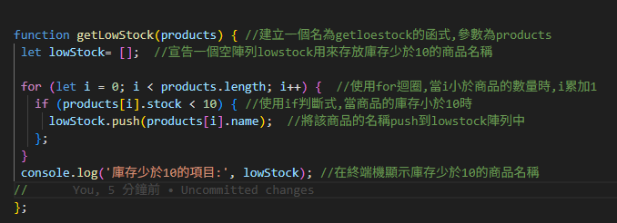
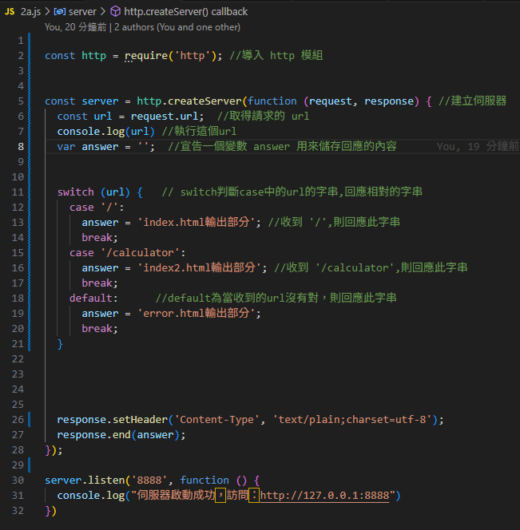
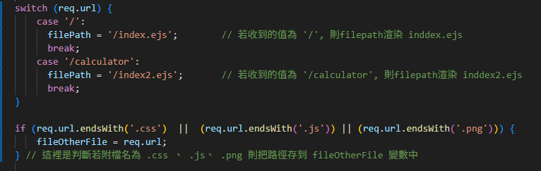
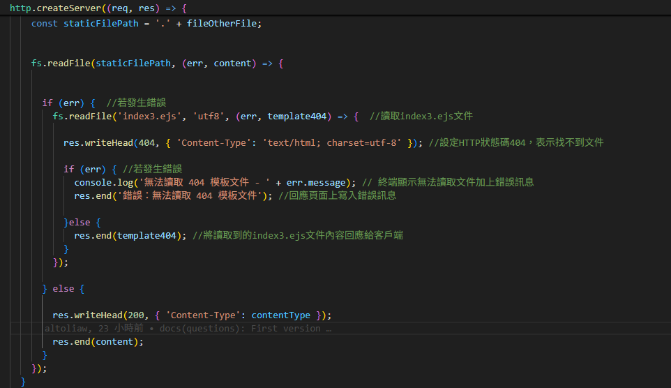

# 第2次隨堂題目-隨堂-QZ2
>
>學號：1234567   (學號和姓名都要寫)
><br />
>姓名：王小明
>

本份文件包含以下主題：(至少需下面兩項，若是有多者可以自行新增)
- [x] 說明內容

## 說明程式與內容

開始寫說明，該說明需說明想法，
並於之後再對上述想法的每一部分將程式進一步進行展現，
若需引用程式區則使用下面方法，
若為.cs檔內程式除了於敘述中需註明檔案名稱外，
還需使用語法` ```語言種類 程式碼 ``` `，其中語言種類若是要用python則使用py，java則使用java，C/C++則使用cpp，
下段程式碼為語言種類選擇csharp使用後結果：

```csharp
public void mt_getResult(){
    ...
}
```

若要於內文中標示部分網頁檔，則使用以下標籤` ```html 程式碼 ``` `，
下段程式碼則為使用後結果：

```html
<%@ Page Language="C#" AutoEventWireup="true" ...>

<!DOCTYPE html>

<html xmlns="http://www.w3.org/1999/xhtml">
<head runat="server">
<meta http-equiv="Content-Type" ...>
    <title></title>
</head>
<body>
    <form id="form1" runat="server">
        <div>
        </div>
    </form>
</body>
</html>
```
更多markdown方法可參閱[https://ithelp.ithome.com.tw/articles/10203758](https://ithelp.ithome.com.tw/articles/10203758)

請在撰寫"說明程式與內容"該塊內容，請把原該塊內上述敘述刪除，該塊上述內容只是用來指引該怎麼撰寫內容。

1. a.

Ans: 
利用常量以及陣列的觀念,陣列可以透過方法改動裡面的值,const常量在語法不能修改會報錯。


1. b.

Ans:


## 創立空陣列,用for迴圈累加i,i判斷哪寫值小於10,放進空陣列
<!-- 請撰寫時，最後一句話再寫一次 -->


1. c.

Ans:

<!--  請撰寫時，第一句話再寫一次  -->

2. a.

Ans:
## 如下圖:


<!--  請撰寫時，第一句話再寫一次  -->

2. b.

Ans:
## 如下圖


<!--  請撰寫時，第一句話再寫一次  -->

2. c.

Ans:

## 如下圖

這裡解釋當客戶端發生錯誤了，回應的狀態以及訊息。若沒有就是將index3.ejs的畫面印出

<!--  請撰寫時，第一句話和最後一句再寫一次  -->

2. d.

Ans:


