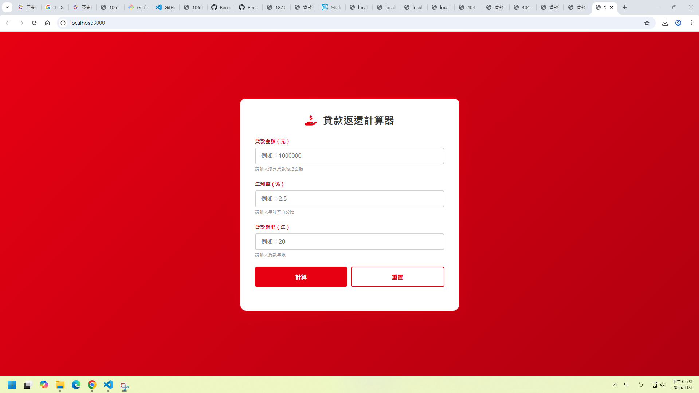

# 第2次隨堂題目-隨堂-QZ2
>
>學號：112111124   (學號和姓名都要寫)
> 
>姓名：游博翔
>

請在撰寫"說明程式與內容"該塊內容，請把原該塊內上述敘述刪除，該塊上述內容只是用來指引該怎麼撰寫內容。

1. a.

Ans: 
## 利用常量以及陣列的觀念,陣列可以透過方法改動裡面的值,const常量在語法不能修改會報錯。

1. b.

Ans:

## 創立空陣列,用for迴圈累加i,i判斷哪寫值小於10,放進空陣列
<!-- 請撰寫時，最後一句話再寫一次 -->

1. c.

Ans:

<!--  請撰寫時，第一句話再寫一次  -->

2. a.

Ans:
## 如下圖:

<!--  請撰寫時，第一句話再寫一次  -->

2. b.

Ans:
## 如下圖

<!--  請撰寫時，第一句話再寫一次  -->

2. c.

Ans:

## 如下圖

這裡解釋當客戶端發生錯誤了，回應的狀態以及訊息。若沒有就是將index3.ejs的畫面印出

<!--  請撰寫時，第一句話和最後一句再寫一次  -->

2. d.

Ans:

